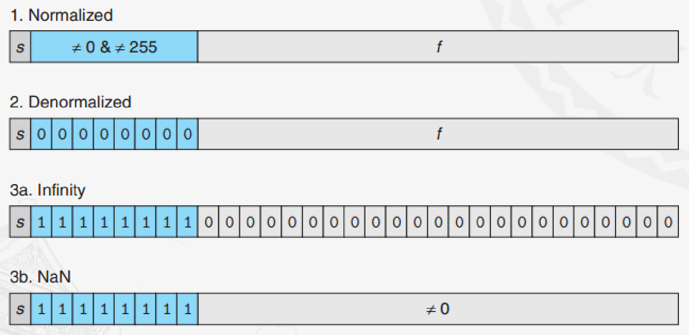
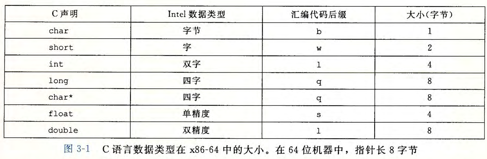
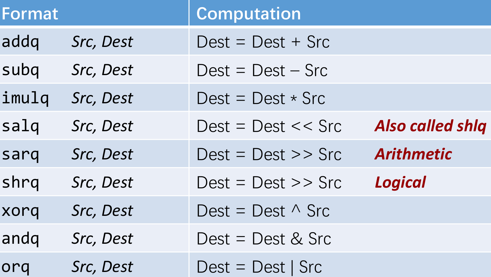
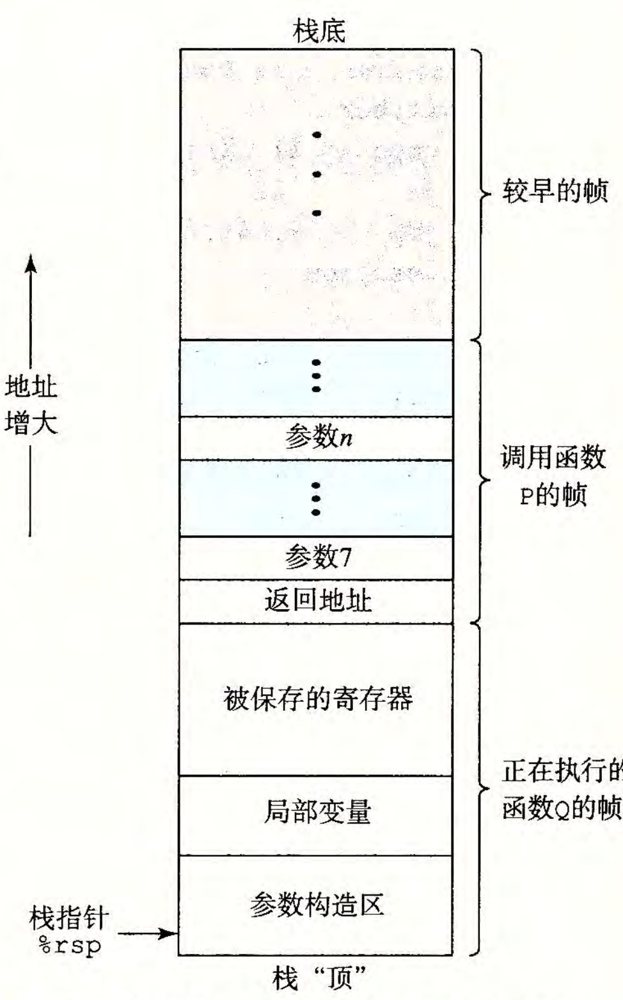
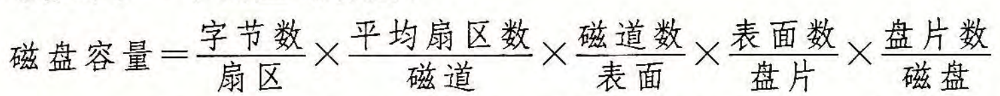
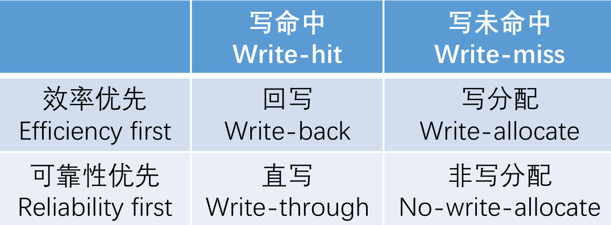
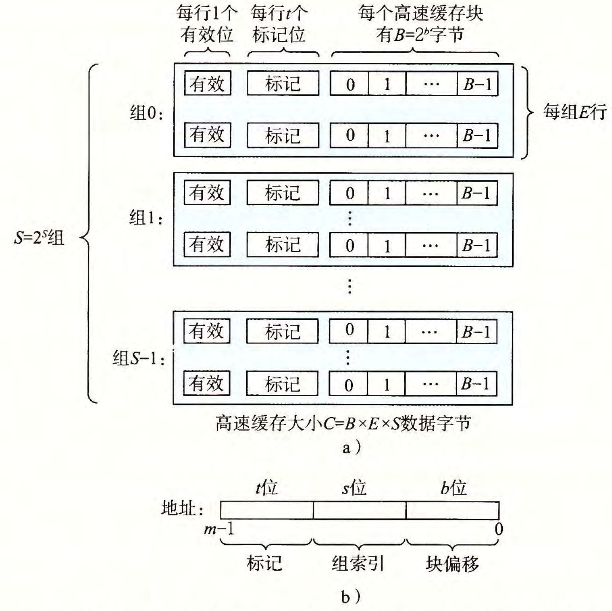
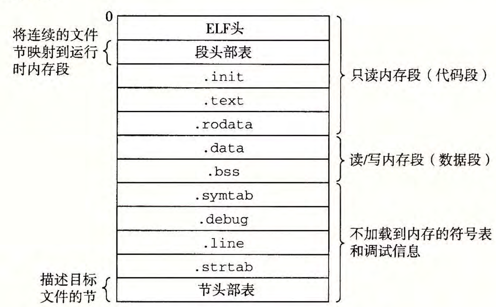

# CSAPP纲要（上）

写一些我在学习 CSAPP 时整理的总结和易错点，这个博客可能写的比较碎且部分内容跳跃，可能不适合作为初学者阅读，建议在大致学习完后看一遍加深影响。

----

## Linux

1. 每个文件都有9个权限位

2. `gcc`指令的几个选项

   * `-o`  输出文件名称

   * `-c`  只编译不链接

   * `-S`  编译成汇编代码

   * `-I`  指定头文件搜索位置

   * `-l`  指定链接库
   
   * `-g`  生成调试信息用于 gdb 

## 整数

1. 字符串的表示与字节序无关
   * `char s[4]`从低地址到高地址表示为`[32 30 32 33]`，打印后`s`的值为 2023

2. 有符号数表示范围为 $-2^{w-1} \sim 2^{w-1}-1$
   无符号数表示范围为 $0 \sim 2^{w}-1$

3. 表达式（运算 / 比较）中有符号数和无符号数混起来时，会将有符号数隐式转换为无符号数

4. 有符号数 int 最小为 `0x80000000`($-2^{31}$)，最大为 `0x7fffffff` ($2^{31}-1$)，故最小值取反加一后还是最小值不变
   * `( - x < y ) && ( - y < x ) == false`可以成立，这是因为当` x = int_min ， y = 0 `时不成立

5. 有符号数右移为算数右移，左边补充最高位

6. 十进制转十六进制：类似转二进制思路，改为除以16

7. 有符号数拓展采用符号位拓展（补充高位以符号位），无符号数采用 0 扩展
   * ` short x = 0b 10000000 00000000; int y = (int)x;` 使用符号位拓展，得到 `y = 0b 11111111 11111111 10000000 0000000`

8. 字节大的类型转为字节小的类型直接位截断
   * `int i = 0x80000000; short x = (short) i;` 转化后` x = 0`

9. 混合有字节小的类型和字节大的类型时，都转化成字节大的类型计算
   * `short s = 0x 7fff; s + (int) 1 == 0x 0000 8000`

10. 有符号数和无符号数相互转换时，二进制位不变，但是值会发生改变

11. `x >> 1`不代表`x / 2`，因为位移运算是向下取整，而除法运算是向 0 取整，要实现等价应该先在 `x` 上加上 $2^{k}-1$ （ k 是右移位数）

## 浮点数

1. float	    1 s + 8 exp + 23 frac = 32 bit
   double	1 s + 11 exp +52 frac = 64 bit

2. 计算公式 $(-1)^s \times 2^E \times M$

   1. 规格化数($\text{exp} \neq 00...00 / 11...11$)

      1. 阶码 E = exp - Bias

      2. Bias = $2^{k-1}-1,k$为exp位数，float = 127 , double = 1023

      3. 尾数 M = 1.frac

      4. s = 0 表示正数，s = 1 表示负数

      5. 能表示的指数 E 范围在 - 126 ~ 127，可表示的数很大 （比 INT_MAX 大）

   2. 非规格化数 ($\text{exp}=00...00$)

      1. E = 1 - Bias

      2. M = 0.frac

      3. exp 和 frac 全部 0 表示 0 (+0/-0)

   3. 无穷 ($\text{exp}=11...11, \text{frac}=00...00$)

      1. 如果发生溢出则使用无穷

   4. NaN ($\text{exp}=11...11, \text{frac}\ne 00...00$)



3. 向偶数舍入（浮点小数舍入方式）

   假设以 `1.RRR...RRDDD...`表示小数，其中R为保留的位，D为舍去的位

   * 如果DD..D < 10..0，则向下舍入

   * 如果DD..D > 10..0，则向上舍入

   * 如要DD..D = 10..0，则向最近偶数舍入，细则如下 ：

     * 如果RR..R = XX..0 (X表示任意值，0或1)，则向下舍入

     * 如果RR..R = XX..1，则向上舍入

4. 数据类型转换的溢出和舍入

   * `int/long`转`float/double`的时候不会出现溢出，但可能舍入
   * `double`转`float`可能溢出或者舍入
   * `float`转`double`不会溢出也不会舍入
   * `double/float`转`int/long`可能会溢出或者舍入

5. 浮点数满足交换律，但是不满足结合律

6. 小数转二进制：多次乘2，如果结果大于1记1，小于1记0，最后得出1.0记1，将记的数字按顺序串起来就是二进制表示

## 汇编

1. 数据类型

   

2. 算数逻辑运算

   

3. `js`表示如果结果为负数则跳转

4. 条件码

   1. 类型

      * SF：负数

      * CF：无符号数溢出（发生进位）

      * OF：有符号数溢出（两个正数相加得负数 / 两个负数相加得正数）

      * ZF：零

   2. 改变：使用`cmp`或者`test`显式设置，或者通过算术运算隐式设置

5. `cmovX`指令是条件数据移动指令，如果满足X则执行`mov`操作，不需要改变控制流，提高处理器执行效率，但是存在风险计算、大量计算、有副作用的计算

6. `movl $1234, %rax`是将高位清零，低位赋值；
   `movl $1234, %eax`是将低位赋值，高位不变

7. `movX`后缀看寄存器，不考虑内存（带括号的）和立即数

8. `movX`不可以同时访问两个地址，最多只能一个地址

9. 立即数没加`0x`就默认按照10进制算

10. `pushq X`相当于先将`%rsp - 8`然后将`X`压入原来`%rsp - 8`到`%rsp`地址的位置

11. 控制流转移过程

    `call` 指令之后会跟着一个地址，执行时会先将`call`指令之后一条指令的地址压入栈中，然后将 PC 的值更新为`call`之后的地址，接着处理器会从 PC 的地址处的指令开始执行。`ret` 指令会先从栈中弹出 `call` 原先压入栈中的地址，然后将该地址赋给 PC，接着 PC 将会从该地址处执行指令。

    寄存器的变化：`call` 会让`%rsp` 寄存器减 8 方便返回地址入栈，同时用调用地址更
    新 PC 寄存器`%rip`的值；`ret` 指令会让`%rsp` 寄存器加 8 并将弹出的地址返回给 PC
    寄存器`%rip`

12. 过程调用

   <div align="center">
      
   </div>
   
   * 调用函数时，返回地址压入调用者的栈中，执行`ret`后从栈中弹出

   * 过程传参时，参数 1~6 通过寄存器传递，在栈的参数构造区中存放其他参数，参数 7 最后压栈（先进后出），都在调用者的栈帧中

   * 被调用者保存寄存器包括：`%rsp, %rbp, %rbx, %r12, %r13, %r14, %r15`

   * 调用者保护寄存器包括：`%rax, %rdi, %rsi, %rdx, %rcx, %r8, %r9, %r10, %r11`

13. 在函数开头可能会有`push %rbp`或者`push %rbx`，为了保护寄存器的值


14. 字节对齐为 $x$ ：结构体数据的起始地址和终止地址均为 $x$ 的倍数（第一个起始为0），未明确说明则按照最高字节数的类型填充（参考北大24期中4、交大19 fall 4.2）

15. 跳转表语句：`movq *.L4(,%rax,8), %rax`  其中跳转表如下，地址是连续的，可以借此确定case的值

   ```asm
   .section .rodata
   	.align 8
   .L4:
   	.quad .L3
   	.quad .L5
   	.quad .L2
   	.quad .L6
   ```

16. 稀疏的`switch`语句会翻译为二分查找的语句，即`if`下嵌套`if`

17. 缓冲区溢出
    1. 定义
       * 利用向缓冲区填充超过其本身容量的数据位数，使得溢出的数据覆盖原先合法数据上，实现让程序执行原先不愿执行的函数或者代码。

    2. 防御手段

       1. 程序设计角度
          * 避免使用可能会造成缓冲区溢出的有风险的函数

       2. 编译器角度

          * **栈随机化**：让栈的位置在程序每次运行时都有变化

          * **栈破坏检测**：加入栈保护者机制，在栈帧中的任何局部缓冲区与栈状态之间存储一个随机产生的特殊的金丝雀值，在函数返回之前，检查金丝雀值，若被改变则程序立即异常中断。

          * **限制可执行代码区域**：限制哪些内存区域能够存放可执行代码
16. `%rbp` 被用作帧指针，便于局部变量寻址

## 处理器体系架构

1. 吞吐量 $TP=\dfrac{1}{T} \times 1000$，其中 T 表示时钟周期(ps)，取决于最大的时延（组合逻辑+寄存器）
   * 1 GIPS 表示1 s执行 $10^9$次指令
   * 单条指令执行时间也取决于最大时延

2. 经典的五级流水线结构
   * 取指
   * 译码
   * 执行
   * 访存
   * 写回

## 存储器体系架构

1. 1 GB = $10^9$ B

2. 容量大小计算公式，要注意两个扇面

   

3. 访问时间公式
   $T_{access} = T_{seek} + T_{rotation} + T_{transfer}$

   * $T_{totation}=\dfrac{1}{2}\times \dfrac{60}{RPM} \times 1000ms$

   * $T_{transfer}=\dfrac{1}{每条磁道扇区数}\times \dfrac{60}{RPM}  \times 1000ms$

   * 主要是寻道时间和旋转延迟（前两个）

   * 寻道时间和旋转延迟大致相等，寻道时间乘 2 可以大致估计

4. 存储器层次的特点：

   * 存储器分层，层次更高的存储结构其存储容量更小、速度更快、每字节成本更高

   * 层次中每一层都缓存来自较低一层的数据

   * 用较低的成本代价，获取较高的性能，缩短存储器与处理器之间的差距

5. 存储技术趋势：

   * 处理器和存储器的性能都在提升

   * 处理器与存储器之间的性能差距越来越大

6. DMA（直接内存访问）：设备可以自己执行读或者写总线事务而不需要 CPU 干涉

## 高速缓存

1. 局部性原理：程序倾向于使用最近访问过的数据和指令，或是与之临近的数据和指令。

   * 时间局部性（山脊）：最近使用过的指令/数据很可能在不久的将来还会再次被使用

   * 空间局部性（斜坡）：临近地址的指令/数据在短期内可能会使用

2. 缓存不命中种类：
   * 冷未命中：一个空的缓存的未命中

     * 预取技术，增大块大小（B增大）

   * 冲突未命中：缓存中存有另一个数据对象导致的不命中

     * 使用更高相联度的 Cache（E增大）

   * 容量未命中：工作集的大小超过缓存的大小

     * 增加 Cache 容量，减少工作集容量

3. 写策略

   1. 写命中

      * 回写：驱逐这个更新过的块时，才把它写到紧接着的低一层

      * 直写：立即将高速缓存块写回到紧接着的低一层缓存

   2. 写不命中

      * 写分配：加载相应的低一层中的块到高速缓存中，然后更新这个高速缓存块

      * 非写分配：避开高速缓存，直接把这个字写到低一层的缓存中

   

4. 注意内存的起始位置，一行只有一个块，这里的地址都是虚拟地址

   

   * S和B都需要是2的n次方

   * 全相联cache的地址里没有组索引位

   * 较高的相联度会增加命中时间，L1 高速缓存一般会选择较低的相联度

   * 较大的块能利用程序中可能存在的空间局部性，但无法利用时间局部性

   * 高速缓存越往下层，越可能使用写回而不是直写

5. 面向Cache的优化

   * 利用空间局部性

     * 局部变量、循环变量顺序重排

   * 利用时间局部性

     * 进行数据分块

6. 矩阵乘法（良好局部性）

   ```c
   for (k = 0; k < n; k++) {
   	for (i = 0; i < n; i++) {
   		r = a[i][k];
   		for (j = 0; j < n; j++)
   			c[i][j] += r * b[k][j];
   	}
   }
   ```

   

## 链接

1. 程序构建过程

   * 预处理

     * 使用`gcc -E`或者`cpp`

     * 处理宏定义

   * 编译

     * 使用`gcc -S`

     * 转为汇编代码

   * 汇编

     * 使用`gcc -c`或者`as`

     * 转为机器语言，得到可重定位目标文件

   * 链接

     * 使用`gcc -static`或者`ld -static`

2. 几个区域

   * `.text`

     * 存放已编译程序的机器代码

   * `.rodata`

     * 存放只读数据（跳转表，`printf`输出格式等）

     * 字符串字面量（如`"hello world"`）

   * `.data`

     * 已初始化的非零全局变量

     * 已初始化的非零 static 变量(包括全局和局部)

   * `.bss`

     * 未初始化的全局变量

     * 未初始化的static变量(包括全局和局部)

     * 已初始化为0的全局变量或者static变量

   * `.symtab`

     * 符号表

   * `stack`

     * 非static的局部变量

   * `heap`

     * 使用`malloc`分配空间的变量
   
3. 可重定位目标文件结构如下，代码段地址是从0开始的

   

4. 几种符号

   * 全局符号：非static的全局变量和函数

   * 外部符号：带有extern前缀的符号

   * 内部符号：static的全局变量和函数

     * 只能在当前文件内有效

5. 强弱符号

   1. 定义

      * 强符号：已经初始化的全局符号

      * 弱符号：未初始化的全局符号

   2. 规则

      * 不允许有多个同名的强符号

      * 若有一个强符号和多个弱符号重名，则选择强符号

      * 若只有多个弱符号，则从中任意选择一个
