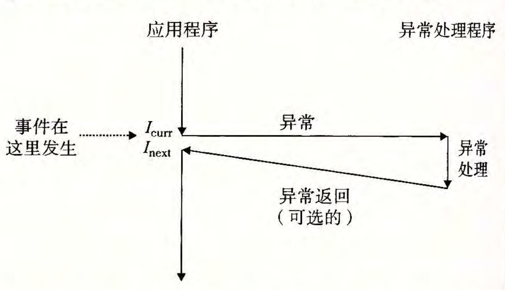
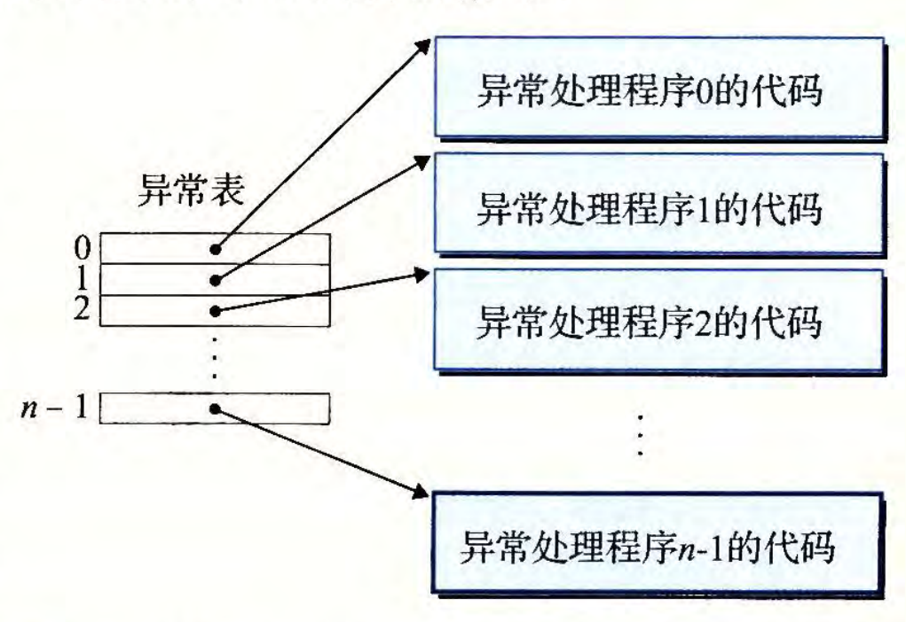
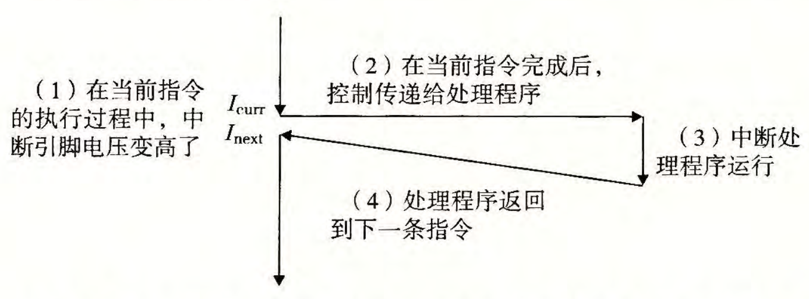

# CSAPP笔记（一） —— 异常控制流和进程（更新中）

写一下我在学习计算机系统基础 2 时的一些笔记，本文主要介绍异常控制流和进程，供大家参考。

----

## 异常

控制流就是一条条指令序列的执行顺序，改变控制流可以通过 **跳转和分支** 、**过程调用和返回** 、**异常控制流** 三种方式。

### 异常控制流

异常是在处理器状态改变时，把控制权转移到内核处理程序的机制，具体如图所示：

当异常发生时，会通过异常表找到对应的异常处理程序地址，然后跳转到该地址执行异常处理程序。如下图所示，每种异常类型都有一个唯一的**异常号**，有特殊的寄存器——**异常表基址寄存器（ETBR）**来存放异常表的起始地址。

### 异常类型

异常类型主要有：

- 异步异常

  - 中断：由外部设备引起，比如键盘输入、鼠标点击等。中断处理程序通常会保存当前的处理器状态，然后处理中断，最后恢复处理器状态并返回到中断发生前的执行位置。

- 同步异常

    - 陷阱：由程序执行引起，比如系统调用、调试断点等。陷阱处理程序通常会保存当前的处理器状态，执行陷阱处理，然后恢复处理器状态并返回到陷阱发生后的下一条指令。
    - 故障：
    - 杂项异常

中断是异步的异常，通常

