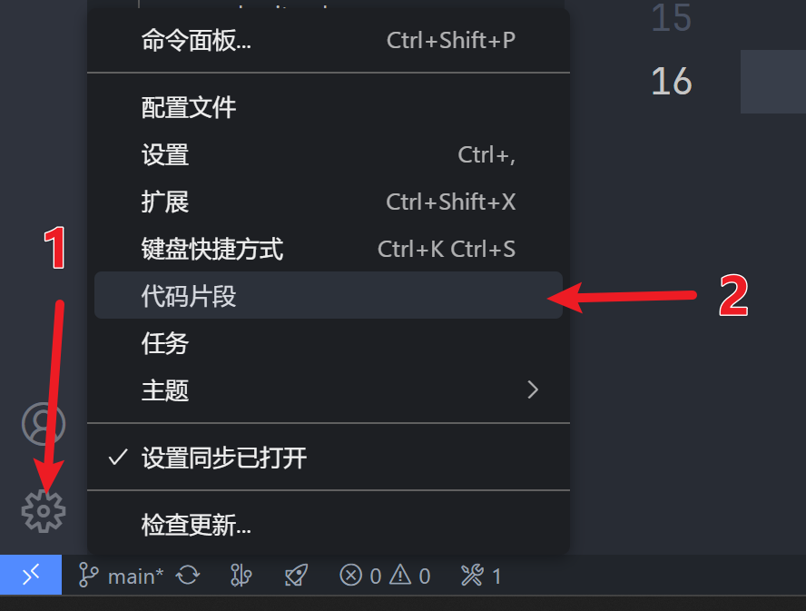
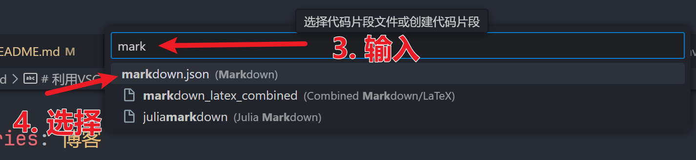
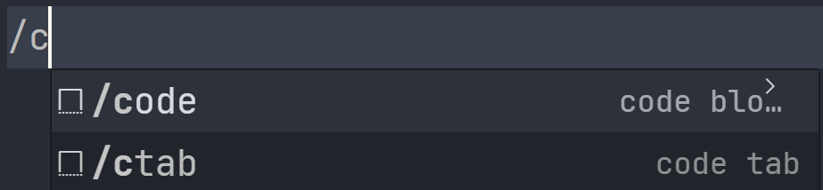
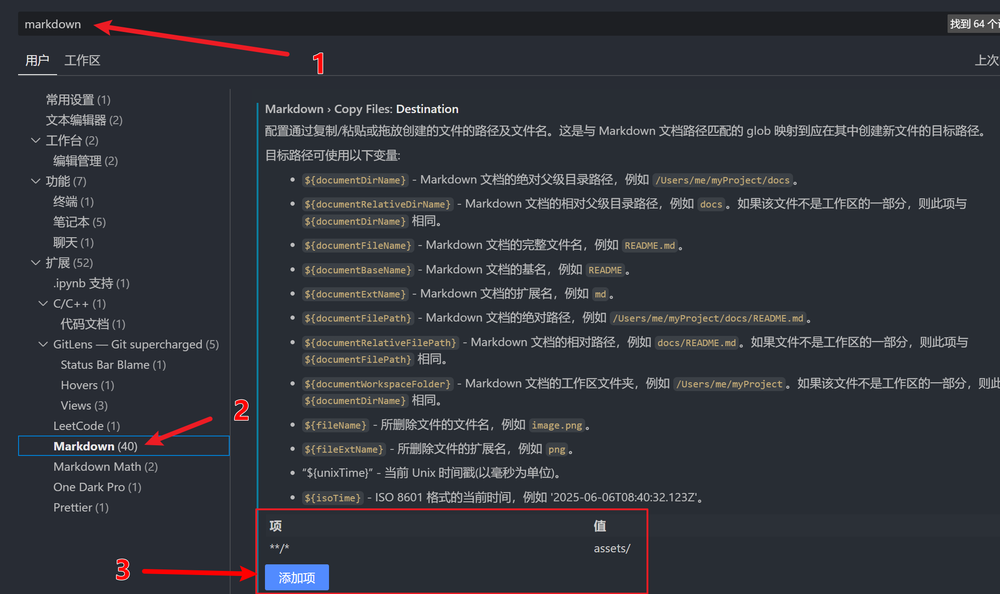

# 利用 VSCode 让你的 markdown 编写起飞

我以前喜欢使用Typora进行做一些笔记或者记录等，但是后面要用到一些高级功能比如快捷键和一些模板，但是Typora研究了很久没找到有效的方法，最近找到了一种快速编写的方法，可以省去很多编写重复文字的时间。

----

## 快捷输入

首先按照图片指示打开代码片段



然后按照下图打开 `markdown.json` 



假设你已经了解`json`的结构组成，之后你可以看到文件注释里提供的example.

```json
"Print to console": {
	"prefix": "log",
	"body": [
		"console.log('$1');",
		"$2"
	],
	"description": "Log output to console"
}
```

这里解释一下，最开头的`"Print to console"`是这个指令的名称，`description`是你对这个指令的描述（非必须），你可以改成你想要的。然后接下来有一个`prefix`和`body`属性，这个是关键，通过输入`prefix`对应内容然后tab，你就可以一次实现输入`body`里的全部内容。

其中`body`为一个字符串数组，每一项代表一行，如果某一项为空则为空一行。在`body`中存在占位符`$1,$2,...`，代表输入后光标分别停留的位置，按 tab 可以到下一个占位符的位置，`$0`为最后一个占位符位置，如果没有这默认在末尾。

比如说下面就是我个人习惯的片段。

```json
"code block": {
    "prefix": "/code",
    "body": [
        "```$1",
        "$2",
        "```"
    ],
    "description": "Insert a code block"
},
"hide":{
    "prefix": "/!",
    "body": "!!$1!!",
    "description": "Hide text"
},
"link": {
    "prefix": "/link",
    "body": [
        "[$1]($2)"
    ],
    "description": "Insert a link"
},
"front matter": {
    "prefix": "/fm",
    "body": [
        "---",
        "categories: $1",
        "tags: $2",
        "---",
        "$0"
    ],
    "description": "Insert front matter"
},
"code tab":{
    "prefix": "/ctab",
    "body": [
        "::: code-tabs#$1",
        "",
        "@tab $2",
        "```$3",
        "$4",
        "```",
        "",
        "@tab $5",
        "```$6",
        "$7",
        "```",
        "",
        "@tab $8",
        "```$9",
        "$10",
        "```",
        "",
        ":::"
    ],
    "description": "Insert code tab"
},
"image": {
    "prefix": "/img",
    "body": "",
    "description": "Insert an image"
}
```

输入后效果如下：



## 插入图片

传统的插入图片你需要把图片放在正确的位置，然后复制它的绝对路径或者相对路径然后才能实现插入。这里我们可以通过设置来实现自动插入。

首先打开设置，按照如下操作。



保存设置后就可以在粘贴图片的时候实现自动创建文件夹然后将图片存放在文件夹内，避免了默认放在当前markdown文件目录内使结构混乱。

以上就是可以提速markdown编写的方法了，当然还有很多技巧，比如说利用Ctrl+B实现加粗等等，大家可以自己去探索，也希望这篇博客能给你一些启发。